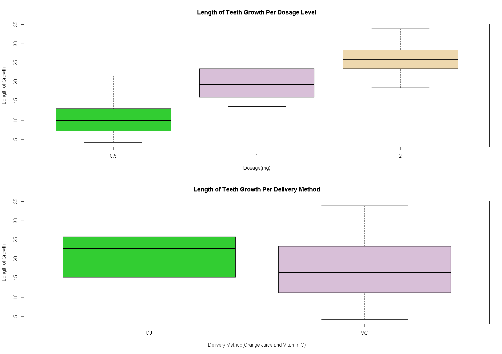
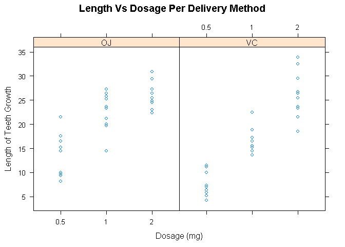
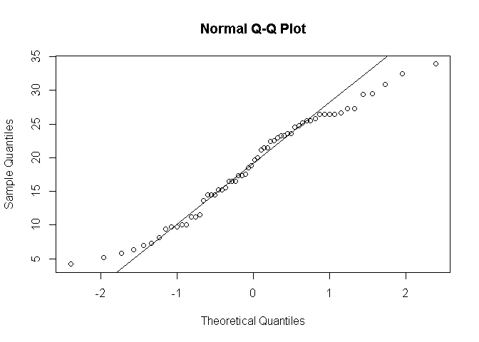

# EFFECT OF DOSAGE AND DELIVERY METHOD ON TOOTH GROWTH OF GUINEA PIGS
Rhyz C. Gomez  

## OVERVIEW

This study explores the effects of different dosages and delivery methods on the tooth growth of guinea pigs. The results of the study show that there is significant differences in the effect of different dosages, with the 2 mg dosage performs best. Furthermore, the effect is better by giving the Vitamin C as an orange juice. 

## EXPLORATORY DATA ANALYSIS
The data that is used in this analysis is from the ToothGrowth data in the R datasets package. The data consists of 60 observations and 3 variables: the len, supp, and dose. The len column describes the length of growth of teeth of guinea pigs at different dosage and delivery methods.  The dose column is a factor variable with 3 dose levels of Vitamin C (0.5,1 and 2 mg). The supp column is the delivery methods.  It is either orange juice (OJ) or Vitamin C (VC).


```r
library(knitr)
data("ToothGrowth")
# The dose column should be a factor
ToothGrowth$dose <- factor(ToothGrowth$dose)
summary(ToothGrowth)
```

```
##       len        supp     dose   
##  Min.   : 4.20   OJ:30   0.5:20  
##  1st Qu.:13.07   VC:30   1  :20  
##  Median :19.25           2  :20  
##  Mean   :18.81                   
##  3rd Qu.:25.27                   
##  Max.   :33.90
```

Using the summary() function, we can say that there is no missing value in the data, with the minimum value of length of teeth growth to be 4.2 and maximum value of 33.9. We can also assume that the length of tooth growth is normally distributed (see Appendix B, figure 1).  


**Figure A: Effect on Tooth Growth Per Dosage**

 
**Figure B: Effect on Tooth Growth By Delivery Methods**

By exploring the data (see Appendix A, Code 1 & 2), Figures A and B show that there is a direct effect on the length of teeth growth of the guinea pigs when the dosage is increase. Further, it seems the delivery method using orange juice is more promising than that of the Vitamin C delivery method.   


## HYPOTHESIS TESTING
Based on Figure A and B, the level of dosage and the delivery method show effects on the length of teeth growth of the guinea pigs. We test this and see whether it is significant or is there really an effect. However, we test the delivery method first and then make it a dummy variable to test the dosage.  

### EFFECT OF DELIVERY METHOD
In Figure A, the Orange Juice (OJ) shows more promising result. By doing hypothesis testing using t.test() function in R, we test whether there is really a difference in the delivery methods. We use paired=FALSE and var.equal=TRUE. The reason for using var.equal=TRUE is that we assume that the variances are equal. However, for further analysis we use bartlett.test() function to test the homogeneity of variances we get a p-value of 0.2331(see Appendix A, Code 3). Hence we can conclude that there is no significant evidence that shows the variances are not equal.  


```r
supptest <- with(ToothGrowth,t.test(len[supp=="OJ"],len[supp=="VC"],paired=FALSE, var.equal = TRUE, alternative="greater"))
suppT <- supptest$statistic
suppP <- supptest$p.value
```

The resulting test shows that the t statistic is 1.9152683, higher than 1.65. The p-value,i.e.0.0301967, is bigger than 0.05 with the confidence interval at [0.471,inf]. Hence, we can conclude that there is significant evidence that shows the Orange Juice have better effect than the Vitamin C method.  

### EFFECT OF DOSAGE (VITAMIN C)
To analyze the effect of dosage, we split the data into two, i.e. by delivery method. After that, we test the dosage per delivery method and see whether there is difference in means of the different dosages.


Again, we use the t.test() function in R to compare the three level of dosages (see Appendix A, code 5-7), with each test uses equal variances and unpaired data.  Comparing dosages 0.5 mg and 2 mg, the t.test() function produces a t-statistic of -10.388, which is quite small compared to -1.65. Also, the p-value (4.957e-09) is very low with a 95% confidence interval of [-21.83,-14.49]. Thus, we can say that there is a difference in the effect of 0.5 mg from the 2 mg. We can also conclude that the 2 mg has higher effect on the tooth growth of guinea pigs compared to 0.5 mg dosage.  

Comparing dosages 1 mg and 2 mg shows the same result that there is a significance difference on the mean of tooth growth of guinea pigs. The t.test() function produces a t-statistic of -5.4698, p-value of 3.398e-05 and 95% confidence interval of [-12.97,-5.77].

Lastly, comparing dosages of 0.5 mg and 1 mg shows also a significant difference between the effect of the two with t-statistic of -7.4634, p-value of 6.492e-07 and 95% confidence interval of [-11.26,-6.32].

### EFFECT OF DOSAGE (ORANGE JUICE)

The following results are produced using the codes in Appendix A(see Code 8-10).


Dosage           PVALUE       TSTATISTIC  CONFIDENCEINTERVAL 
---------------  ----------  -----------  -------------------
0.5 mg vs 1 mg   8.358e-05       -5.0486  [-13.41,-5.53]     
1 mg vs 2 mg     0.03736         -2.2478  [-13.41,-5.53]     
0.5 mg vs 2 mg   3.402e-07       -7.8170  [-16,28,-9.38]     

The table shows that for every comparison there is significant evidence that one of the dosages is better than the other.

## CONCLUSION

By assuming the length of growth of guinea's pigs teeth in the data to be normal and the variances are from the same distribution, we can conclude that the effects of different dosages are significantly different with 2 mg dosage having the best effect. Also, We can conclude that it is better to give the vitamin C as orange juice.


\newpage

### APPENDIX A

#### Code 1

```r
par(mfrow=c(2,1))
plot(ToothGrowth$dose,ToothGrowth$len,main="Length of Teeth Growth Per Dosage Level",xlab="Dosage(mg)",ylab="Length of Growth",font.lab=2,col=c("limegreen","thistle","wheat2"))
plot(ToothGrowth$supp,ToothGrowth$len,main="Length of Teeth Growth Per Delivery Method",xlab="Delivery Method(Orange Juice and Vitamin C)",font.lab=2,col=c("limegreen","thistle"),ylab="Length of Growth")
```

#### Code 2

```r
library(lattice)
xyplot(len~dose|supp,data=ToothGrowth,main="Length Vs Dosage Per Delivery Method",ylab="Length of Teeth Growth",xlab="Dosage (mg)")
```

#### Code 3

```r
with(ToothGrowth,bartlett.test(len~supp))
```

```
## 
## 	Bartlett test of homogeneity of variances
## 
## data:  len by supp
## Bartlett's K-squared = 1.4217, df = 1, p-value = 0.2331
```

#### Code 4

```r
VCtoothgrowth <- ToothGrowth[ToothGrowth$supp=="VC",]
OJtoothgrowth <- ToothGrowth[ToothGrowth$supp=="OJ",]
```

#### Code 5

```r
with(VCtoothgrowth,t.test(len[dose==0.5],len[dose==1],var.equal = TRUE,paired = FALSE))
```

```
## 
## 	Two Sample t-test
## 
## data:  len[dose == 0.5] and len[dose == 1]
## t = -7.4634, df = 18, p-value = 6.492e-07
## alternative hypothesis: true difference in means is not equal to 0
## 95 percent confidence interval:
##  -11.264346  -6.315654
## sample estimates:
## mean of x mean of y 
##      7.98     16.77
```

#### Code 6

```r
with(VCtoothgrowth,t.test(len[dose==1],len[dose==2],var.equal = TRUE,paired = FALSE))
```

```
## 
## 	Two Sample t-test
## 
## data:  len[dose == 1] and len[dose == 2]
## t = -5.4698, df = 18, p-value = 3.398e-05
## alternative hypothesis: true difference in means is not equal to 0
## 95 percent confidence interval:
##  -12.96896  -5.77104
## sample estimates:
## mean of x mean of y 
##     16.77     26.14
```

#### Code 7

```r
with(VCtoothgrowth,t.test(len[dose==0.5],len[dose==2],var.equal = TRUE,paired = FALSE))
```

```
## 
## 	Two Sample t-test
## 
## data:  len[dose == 0.5] and len[dose == 2]
## t = -10.388, df = 18, p-value = 4.957e-09
## alternative hypothesis: true difference in means is not equal to 0
## 95 percent confidence interval:
##  -21.83284 -14.48716
## sample estimates:
## mean of x mean of y 
##      7.98     26.14
```

#### Code 8

```r
with(OJtoothgrowth,t.test(len[dose==0.5],len[dose==1],var.equal = TRUE,paired = FALSE))
```

```
## 
## 	Two Sample t-test
## 
## data:  len[dose == 0.5] and len[dose == 1]
## t = -5.0486, df = 18, p-value = 8.358e-05
## alternative hypothesis: true difference in means is not equal to 0
## 95 percent confidence interval:
##  -13.410814  -5.529186
## sample estimates:
## mean of x mean of y 
##     13.23     22.70
```

#### Code 9

```r
 with(OJtoothgrowth,t.test(len[dose==1],len[dose==2],var.equal = TRUE,paired = FALSE))
```

```
## 
## 	Two Sample t-test
## 
## data:  len[dose == 1] and len[dose == 2]
## t = -2.2478, df = 18, p-value = 0.03736
## alternative hypothesis: true difference in means is not equal to 0
## 95 percent confidence interval:
##  -6.5005017 -0.2194983
## sample estimates:
## mean of x mean of y 
##     22.70     26.06
```

#### Code 10

```r
with(OJtoothgrowth,t.test(len[dose==0.5],len[dose==2],var.equal = TRUE,paired = FALSE))
```

```
## 
## 	Two Sample t-test
## 
## data:  len[dose == 0.5] and len[dose == 2]
## t = -7.817, df = 18, p-value = 3.402e-07
## alternative hypothesis: true difference in means is not equal to 0
## 95 percent confidence interval:
##  -16.278223  -9.381777
## sample estimates:
## mean of x mean of y 
##     13.23     26.06
```


### APPENDIX B

#### Figure 1

```r
qqnorm(ToothGrowth$len)
qqline(ToothGrowth$len)
```




#### Figure B.2

```r
with(ToothGrowth,bartlett.test(len~supp))
```

```
## 
## 	Bartlett test of homogeneity of variances
## 
## data:  len by supp
## Bartlett's K-squared = 1.4217, df = 1, p-value = 0.2331
```
